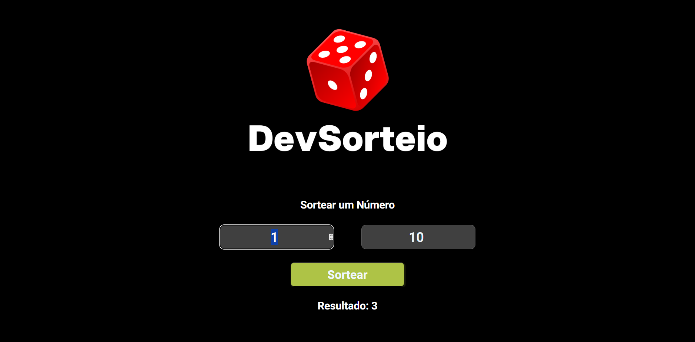

# Sorteador de Números

## Site em telas padrões

## Site em telas menores (com resposividade)

Este é um simples sorteador de números que permite gerar um número aleatório dentro de um intervalo definido pelo usuário. O projeto é feito em HTML, CSS e JavaScript.

## Funcionalidades

- Permite ao usuário inserir dois números: um valor mínimo e um valor máximo.
- Ao clicar no botão "Sortear", um número aleatório é gerado dentro do intervalo especificado.
- O resultado é exibido na tela.

## Tecnologias Utilizadas

- **HTML**: Estrutura básica da página.
- **CSS**: Estilização da página e responsividade.
- **JavaScript**: Lógica para gerar e exibir números aleatórios.

